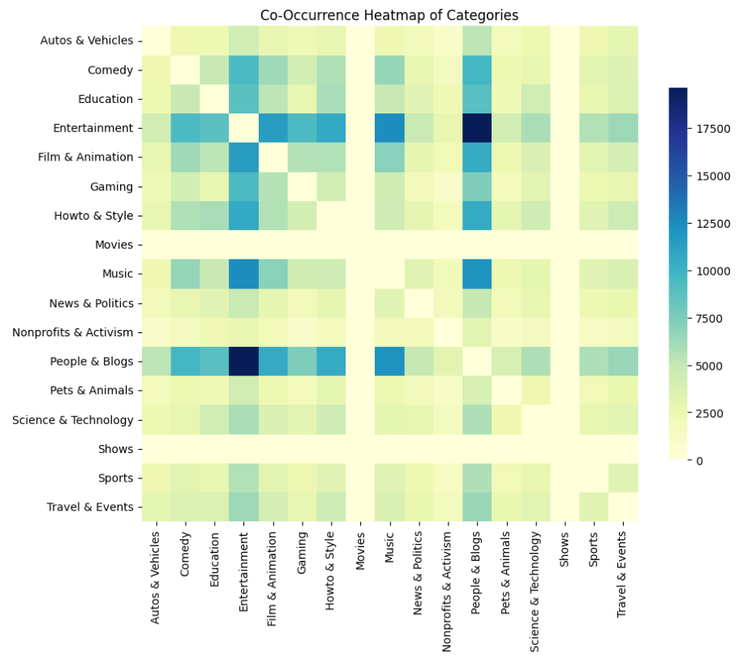

### Co_occurence matrix and heatmap

In the initial phase of our analysis, we will compute the co-occurrence matrix of categories across YouTube channels and visualize it using a heatmap and a network graph. The primary objective is to uncover relationships and overlaps between different types of content, which will allow us to gain insights into content diversification strategies and niche formation on the platform.

Understanding how categories co-occur will help us detect strong connections between content types (for instance: "Gaming" and "Music"), potentially indicating channels that cater to overlapping audiences. By visualizing these relationships as a network, we will highlight tightly connected clusters, revealing content ecosystems and emerging trends.

This analysis will also serve as a foundation for inspecting channel diversity in subsequent phases. By identifying which channels cover multiple categories, we can better understand the impact of content diversification on channel growth and audience engagement.

