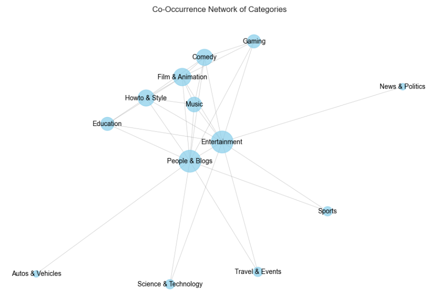
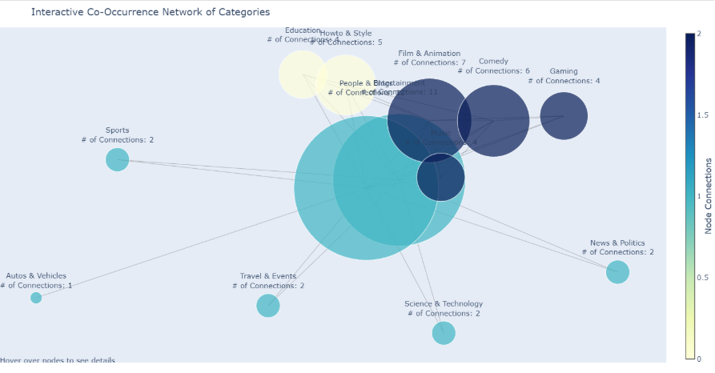

### Co_occurence matrix and heatmap

In the initial phase of our analysis, we will compute the co-occurrence matrix of categories across YouTube channels and visualize it using a heatmap and a network graph. The primary objective is to uncover relationships and overlaps between different types of content, which will allow us to gain insights into content diversification strategies and niche formation on the platform.

Understanding how categories co-occur will help us detect strong connections between content types (for instance: "Gaming" and "Music"), potentially indicating channels that cater to overlapping audiences. By visualizing these relationships as a network, we will highlight tightly connected clusters, revealing content ecosystems and emerging trends.

This analysis will also serve as a foundation for inspecting channel diversity in subsequent phases. By identifying which channels cover multiple categories, we can better understand the impact of content diversification on channel growth and audience engagement.

**Observations**

The heatmap indicates that categories such as Entertainment and People & Blogs serve as central connectors among other categories. Additionally, it highlights frequent co-occurrences among categories like Gaming, Music, Film & Animation, and Comedy.

### Co_occurence Network

To better understand the relationships between different content categories, we analyze the co-occurrence patterns between them across channels. By visualizing these co-occurrences in a **network plot** , we can uncover clusters of categories that frequently appear together, providing insights into content strategies and audience interests. This visualization will help us identify key content synergies and how channels group their themes, ultimately shedding light on the dynamics of content diversification on the platform.

**Observations**

The central role of the "People & Blogs" and "Entertainment" categories suggests they serve as hubs that connect various other content genres on YouTube. These more general, cross-cutting categories likely overlap with and incorporate elements from more specialized categories. The clustering of "Gaming", "Music", "Comedy", and "Film & Animation" indicates these genres tend to co-occur and may share common audiences or creative elements. This makes sense, as gaming, music, comedy, and animated content often intersect in the entertainment space. Similarly, the clustering of "Education" and "Howto & Style" points to synergies between instructional/tutorial content and self-improvement/lifestyle content. These categories likely cater to viewers seeking knowledge and personal development. The relative isolation of categories like "Sports", "Science & Technology", and "News & Politics" suggests they have more distinct, specialized content that does not overlap as readily with the broader entertainment and lifestyle-oriented categories. These genres likely appeal to more niche audiences.

After visualizing the co-occurrence network, we will apply clustering techniques to identify distinct groups of categories more clearly. This will help us pinpoint content clusters that frequently co-occur, revealing patterns in how channels organize their topics. To achieve this, we will use Louvain's method, a community detection algorithm that maximizes modularity to find optimal groupings. The method works by iteratively assigning nodes (categories) to communities in a way that increases the density of edges within communities while minimizing the density between them, providing clear, meaningful clusters.

Let's make things more interactive!

This plot reinforces the clusters identified in the previous visualization. However, it also highlights a limitation of Louvain's algorithm: it fails to recognize isolated categories as distinct clusters. Instead, these categories are often grouped with others, despite not sharing significant co-occurrence relationships. This issue arises because Louvain's method focuses on maximizing modularity, which can sometimes lead to less accurate representations of small or isolated communities that lack strong connections. To address this, additional refinement techniques or alternative community detection algorithms might be necessary to better capture these isolated categories.
